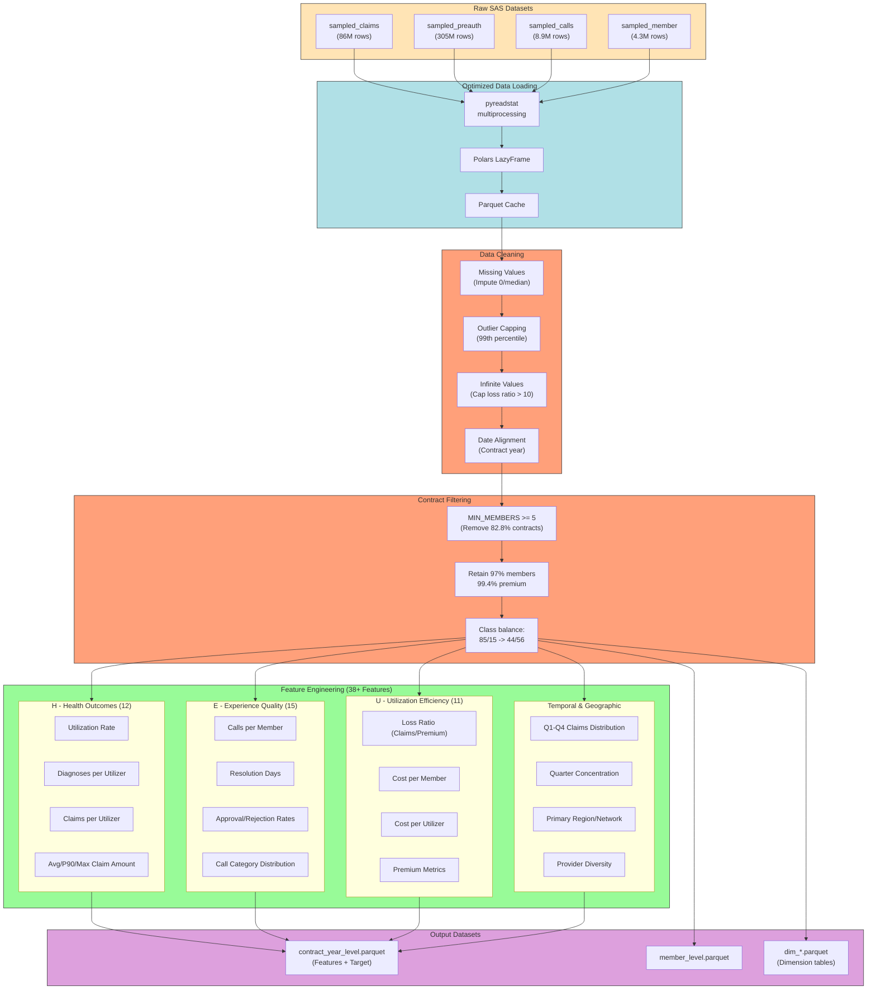
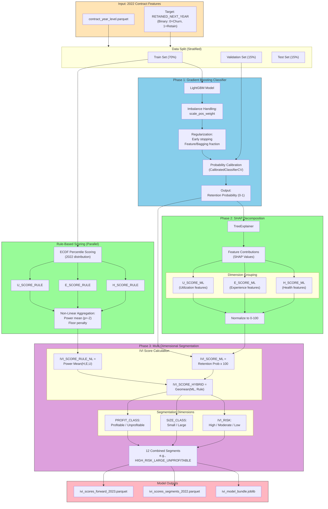
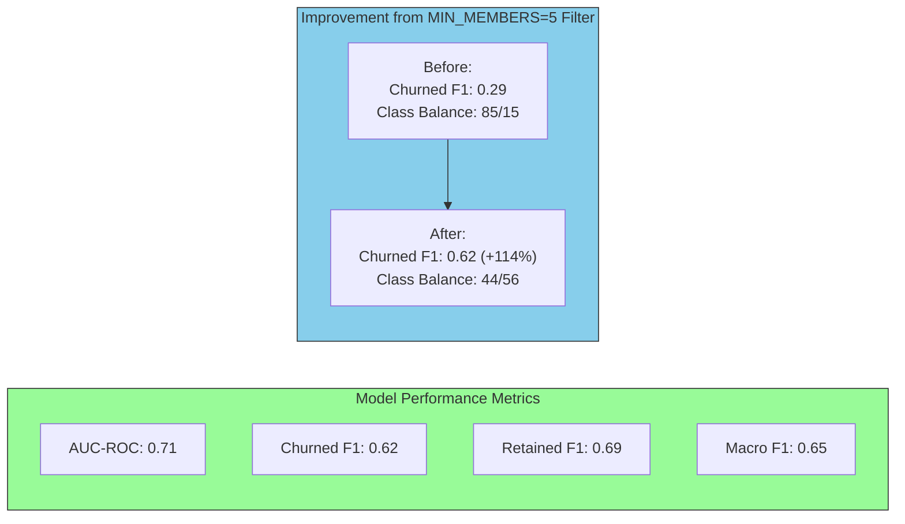

# IVI Pipeline Diagrams

This file contains diagrams for the IVI (Intelligent Value Index) system architecture, including data preprocessing, feature engineering, and ML model pipelines.

## 1. Data Preprocessing & Feature Engineering Pipeline

---

## 2. IVI ML Model Pipeline - Three-Phase Architecture

---

## 3. Complete IVI System Architecture

```mermaid
flowchart LR
    subgraph DATA["Data Sources"]
        direction TB
        claims["Claims (86M)"]
        preauth["Pre-auth (305M)"]
        calls["Calls (8.9M)"]
        members["Members (4.3M)"]
    end

    subgraph PREPROCESS["Preprocessing Pipeline"]
        direction TB
        load["Data Loading<br/>(pyreadstat + Polars)"]
        clean["Cleaning<br/>(Missing, Outliers)"]
        filter["Filtering<br/>(MIN_MEMBERS >= 5)"]
        features["Feature Engineering<br/>(38+ features: H, E, U)"]
    end

    subgraph MODEL["ML Pipeline"]
        direction TB
        lgbm["LightGBM<br/>Retention Classifier"]
        shap["SHAP<br/>Decomposition"]
        calibrate["Probability<br/>Calibration"]
    end

    subgraph SCORING["IVI Scoring Engine"]
        direction TB
        ivi_ml["IVI_SCORE_ML"]
        ivi_rule["IVI_SCORE_RULE"]
        ivi_hybrid["IVI_SCORE_HYBRID"]
        subscores["Sub-Scores:<br/>H / E / U"]
    end

    subgraph SEGMENTS["Segmentation"]
        direction TB
        seg1["Critical<br/>(High Risk, Large, Unprofitable)"]
        seg2["Priority<br/>(High Risk, Large, Profitable)"]
        seg3["Monitoring<br/>(Moderate Risk)"]
        seg4["Nurture<br/>(Low Risk)"]
    end

    subgraph ACTIONS["Recommended Actions"]
        direction TB
        a1["Immediate Intervention"]
        a2["Account Manager Review"]
        a3["Wellness Programs"]
        a4["Maintain Relationship"]
    end

    subgraph DASHBOARD["Dashboard"]
        direction TB
        port["Portfolio Overview"]
        dive["Client Deep Dive"]
        kpi["KPI Explorer"]
        seg_view["Segment Analysis"]
    end

    DATA --> PREPROCESS --> MODEL --> SCORING --> SEGMENTS --> ACTIONS
    SEGMENTS --> DASHBOARD

    style DATA fill:#FFE4B5,stroke:#333
    style PREPROCESS fill:#B0E0E6,stroke:#333
    style MODEL fill:#98FB98,stroke:#333
    style SCORING fill:#DDA0DD,stroke:#333
    style SEGMENTS fill:#FFB6C1,stroke:#333
    style ACTIONS fill:#90EE90,stroke:#333
    style DASHBOARD fill:#87CEEB,stroke:#333
```

---

## 4. Model Performance Summary

---

## 5. IVI Score Interpretation

| IVI Score Range | Risk Level | Interpretation | Recommended Action |
|-----------------|------------|----------------|-------------------|
| 0-30 | High Risk | Client likely to churn | Immediate intervention needed |
| 30-60 | Moderate Risk | Borderline - investigate sub-scores | Account review required |
| 60-100 | Low Risk | Client likely to renew | Maintain relationship |

### Sub-Score Investigation

| Sub-Score | Low Score Symptom | Root Cause Examples | Action |
|-----------|-------------------|---------------------|--------|
| **H Score** | High utilization, many diagnoses | Insufficient preventive care | Health screening, disease management |
| **E Score** | High rejection rate, long resolution | Poor provider coverage in region | Expand network, dedicated handler |
| **U Score** | Loss ratio > 1.5, high cost/member | Older workforce, chronic conditions | Wellness programs, premium adjustment |

---

## File Locations

- **PlantUML Diagrams:** [ivi_pipeline_diagrams.puml](ivi_pipeline_diagrams.puml)
- **Data Pipeline Notebook:** [01_Data_Exploration_Cleaning.ipynb](../notebooks/01_Data_Exploration_Cleaning.ipynb)
- **Business Insights:** [02_Business_Insights_Analysis.ipynb](../notebooks/02_Business_Insights_Analysis.ipynb)
- **ML Model:** [03_IVI_ML_Model.ipynb](../notebooks/03_IVI_ML_Model.ipynb)
- **Dashboard:** [../dashboard/app.py](../dashboard/app.py)
